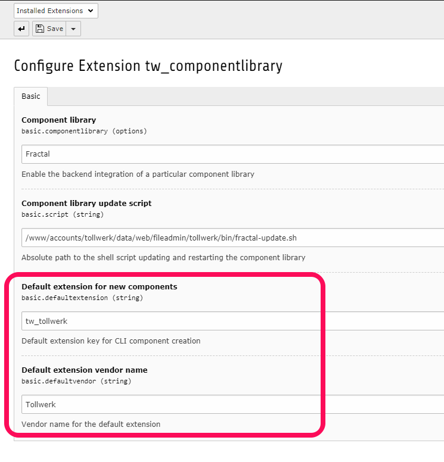
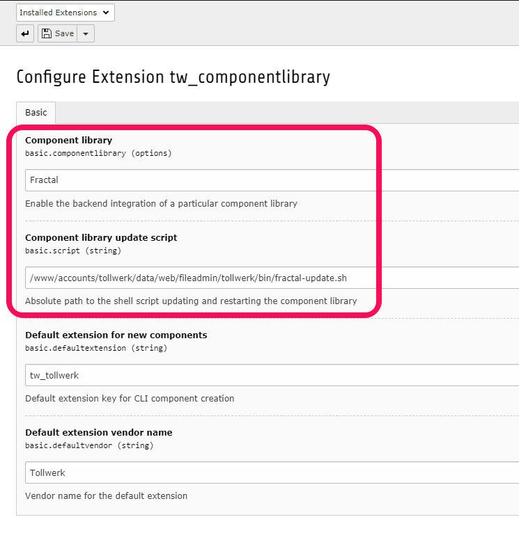
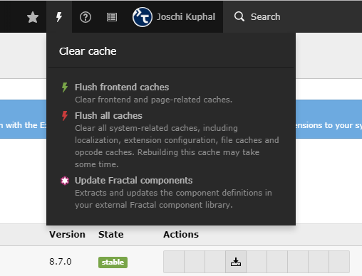

# tw_componentlibrary

> Component library features for your TYPO3 project

About
-----

This TYPO3 extension

1. encourages and supports the development of self-contained, re-usable function and design modules ("**components**") along with your TYPO3 project and
2. exposes these components via a JSON API so that **component library, testing and styleguide tools** like [Fractal](http://fractal.build) can [extract and render](https://github.com/tollwerk/fractal-typo3) your components individually and independently of your TYPO3 frontend.

### Component types

The extension distiguishes 3 main types of components:

* **TypoScript components**: Require a [TypoScript](https://docs.typo3.org/typo3cms/TyposcriptReference/) path with an object definition to render (e.g. `lib.menu`, defined as `HMENU`).
* **Fluid template components**: Require a [Fluid template file](https://github.com/TYPO3/Fluid) (e.g. an Extbase / Fluid partial or standalone Fluid template) and an optional set of rendering parameters / variables.
* **Extbase plugin components**: Require an [Extbase controller](https://docs.typo3.org/typo3cms/ExtbaseGuide/Extbase/Step3Documentation/ActionController.html), a controller action to call and possibly a list of parameters to pass to the controller action. 

The extension **doesn't impose any requirements towards your TypoScript, Fluid templates or directory layout** except that every component must be individually addressable. That is, you cannot expose e.g. just a part of a rendered Fluid template as a component. In that case, you'd have to outsource the desired part as a partial file of its own.

Usage
-----

### Installation

Install the extension into your [composer mode TYPO3](https://wiki.typo3.org/Composer) installation:

```bash
cd /path/to/site/root
composer require tollwerk/tw-componentlibrary
```

Alternatively, [download the latest source package](https://github.com/tollwerk/TYPO3-ext-tw_componentlibrary/releases) and extract its contents to `typo3conf/ext/tw_componentlibrary`.

Enable the extension via the TYPO3 extension manager.


### Declaring components

You can declare components either manually (described below) or using the [command line component kickstarter](#command-line-component-kickstarter) .

1. Create and install an empty TYPO3 extension that is going to hold your component definitions. Alternatively, pick an existing extension you've got write access to. It's possible to have multiple of these **component provider extensions**. If you're using and maintaining custom extensions anyway, I recommend using these for providing components on an per-extension basis.
2. Create a `Components` directory inside the provider extension's root directory. In case you're running [TYPO3 in composer mode](https://wiki.typo3.org/Composer), make sure this directory is properly mapped to the `Component` namespace. You might have to add something like this to your main `composer.json` file (replace the vendor name, extension key and paths with appropriate local values):
    ```json
    {
        "autoload": {
            "psr-4": {
                "Vendor\\ExtKey\\Component\\": "web/typo3conf/ext/ext_key/Components/"
            }
        }
    }
    ```
3. Especially if you're going to have a lot of components it's advisable to organise them in a hierarchical structure. Create a suitable directory layout below your `Components` folder to reflect this hierarchy. Use [UpperCamelCase](https://en.wikipedia.org/wiki/Camel_case) directory names without spaces, underscores and special characters — external systems can use the word boundaries for transforming these e.g. into a navigation tree. Your directory layout could look something like this:
    ```bash
    ext_key
    `-- Components
        |-- Composite
        |   `-- Form
        `-- Generic
            |-- Form
            `-- Typography
    ```
4. Start creating **component declarations** by creating PHP class files at appropriate locations in your directory layout. Each file must declare exactly **one class** extending one of the **main component type base classes** (see below). The file and class names must be identical, should be in [UpperCamelCase](https://en.wikipedia.org/wiki/Camel_case) and must end with the suffix `…Component` (respectively `…Component.php` for the file name). The part before `…Component` will be used as the component by external tools. In addition to the base version of a component you may provide **variants** of that component by adding an underscore and appendage to the file and class name. System like Fractal can use this for a grouped display of component variants:
    ```bash
    ext_key
    `-- Components
        `-- Generic
            `-- Form
                |-- ButtonComponent.php
                |-- Button_IconLeftComponent.php
                |-- Button_IconRightComponent.php
                |-- Button_LinkComponent.php
                |-- Button_LinkIconLeftComponent.php
                `-- Button_LinkIconRightComponent.php
    ```
5. Use the `configure()` method of your component declaration to specify the individual component properties. While each component type brings a small set of specific properties (see below), the majority of instructions is [common to all component types](#common-properties).     

#### TypoScript component

Use the `setTypoScriptKey()` method to specify the TypoScript object that renders the component output. The key will be evaluated for the page ID specified by the `$page` property (see [common properties](#common-properties)).

```php
<?php

namespace Vendor\ExtKey\Component;

use Tollwerk\TwComponentlibrary\Component\TypoScriptComponent;

/**
 * Example TypoScript component
 */
class ExampleTypoScriptComponent extends TypoScriptComponent
{
    /**
     * Configure the component
     */
    protected function configure()
    {
        $this->setTypoScriptKey('lib.example');
    }
}
```

#### Fluid template component

Use the `setTemplate()` method to specify the Fluid template file that renders the component output. Specify rendering parameters using the `setParameter()` method (works just like `$this->view->assign('param', 'value')` in Extbase controller actions).

```php
<?php

namespace Vendor\ExtKey\Component;

use Tollwerk\TwComponentlibrary\Component\FluidTemplateComponent;

/**
 * Example Fluid template component
 */
class ExampleFluidTemplateComponent extends FluidTemplateComponent
{
    /**
     * Configure the component
     */
    protected function configure()
    {
        $this->setTemplate('EXT:ext_kex/Resources/Private/Partials/Component.html');
        $this->setParameter('param', 'value');
    }
}
```

For convenience reasons, Fluid template components can read in external JSON files for setting parameters. JSON parameter files must be named after their associated component files and lie in the same directory:

```bash
|-- ButtonComponent.json
`-- ButtonComponent.php
```

The key / value pairs inside the JSON file will be used as input for the `setParameter()` method.

#### Extbase plugin component

To configure an Extbase plugin component, use the `setExtbaseConfiguration()` method to specify the plugin name, the controller class name and the controller action to be called. The output will be rendered using the Fluid template associated with the controller action. You can specify action arguments via `setControllerActionArgument()`.

```php
<?php

namespace Vendor\ExtKey\Component;

use Tollwerk\TwComponentlibrary\Component\ExtbaseComponent;

/**
 * Example Extbase plugin component
 */
class ExampleExtbaseComponent extends ExtbaseComponent
{
    /**
     * Configure the component
     */
    protected function configure()
    {
        $this->setExtbaseConfiguration('PluginName', MyCustomController::class, 'action');
        $this->setControllerActionArgument('param', [1, 2, 3]);
    }
}
```

#### Common properties

There's a bunch of component properties and methods that are common to all component types. Some of them are controlled via [TypoScript constants](#typoscript-constants), others by overriding [component class properties](#component-properties) or calling [shared configuration methods](#configuration-methods).
 
##### TypoScript constants

Use the TypoScript constants to globally configure the HTML documents wrapped around your components when rendered by external systems. You can add base files, web fonts and libraries this way (`global.css`, jQuery, etc.). All resources can be referenced absolutely (starting with `http://` or `https://`), relatively (`/fileadmin/css/...`) or using a TYPO3 extension prefix (`EXT:ext_key/Resources/...`).

TypoScript-Namensraum: `plugin.tx_twcomponentlibrary.settings`

| Constant        | Type   | Default | Description                                                                                                                    |
|:----------------|:-------|:--------|:-------------------------------------------------------------------------------------------------------------------------------|
| `stylesheets`   | String | Empty   | Comma separated list of CSS stylesheets to be included **for all components**.                                                 |
| `headerScripts` | String | Empty        | Comma separated list of JavaScript resources to be included in the `<head>` section **for all components**.                    |
| `footerScripts` | String | Empty        | Comma separated list of JavaScript resources to be included right before the closing `</body>` element **for all components**. |

##### Component properties

There are a couple of **protected** object properties you can override in your component classes to alter the default behaviour.

| Property             | Type   | Default | Description                                                                          |
|:---------------------|:-------|:--------|:-------------------------------------------------------------------------------------|
| `$page`              | `int`    | `1`     | TYPO3 page ID used when requesting the component (might affect effective TypoScript) |
| `$typeNum`           | `int`    | `0`     | `type` parameter used when requesting the component                                  |
| `$sysLanguage`       | `int`    | `0`     | System language UID used when requesting the component.                              |
| `$languageParameter` | `string` | `"L"`   | Language parameter name (used as GET variable name)                                       |
| `$label`             | `string` | Empty   | Alternative label for the component (might be used by external systems)              |
|`$status`            | `string` | `"wip"` | Arbitrary component status label for use in external systems |
|`$request`            | `Request`¹ | `Request`¹ | Web request object used for requesting the component. You can add arguments with `$request->setArgument('name', 'value')` |
|`$preview`            | `TemplateInterface`² | `BasicTemplate`³ | Preview template used for rendering the component for external systems. Supports a couple of configuration methods, [see below](#preview-templates). |

* ¹ `\TYPO3\CMS\Extbase\Mvc\Web\Request`
* ² `\Tollwerk\TwComponentlibrary\Component\Preview\TemplateInterface`
* ³ `\Tollwerk\TwComponentlibrary\Component\Preview\BasicTemplate`

Example usage:

```php
<?php

namespace Vendor\ExtKey\Component;

use Tollwerk\TwComponentlibrary\Component\FluidTemplateComponent;

/**
 * Example Fluid template component
 */
class ExampleFluidTemplateComponent extends FluidTemplateComponent
{
    /**
     * Component status
     *
     * @var int
     */
    protected $status = self::STATUS_READY;
    
    /**
     * Label
     *
     * @var string
     */
    protected $label = 'Button with icon';
    
    /**
     * Configure the component
     */
    protected function configure()
    {
        $this->setTemplate('EXT:ext_kex/Resources/Private/Partials/Button/Icon.html');
    }
}
```

##### Configuration methods

Use the following methods to further configure your components.

```php
<?php

namespace Tollwerk\TwComponentlibrary\Component;

use \Tollwerk\TwComponentlibrary\Component\ComponentInterface;

/**
 * Abstract component
 */
abstract class AbstractComponent implements ComponentInterface
{
    /**
     * Add a notice
     * 
     * Fractal displays the notice in the "Notes" tab (only available for the default component variant)
     *
     * @param string $notice Notice
     */
    protected function addNotice($notice) {}
    
    /**
     * Set a custom preview template
     * 
     * Overrides the default preview template facilitating the `stylesheets`, `headerScript` and `footerScript` TypoScript constants
     *
     * @param TemplateInterface|string|null $preview Preview template
     */
    protected function setPreview($preview) {}
}
```

##### Preview templates
  
By default, the builtin `BasicTemplate` is used for rendering components for external systems. You can use your custom template as long as you implement the `TemplateInterface`. The default `BasicTemplates` supports a couple of configuration methods:
 
```php
<?php

namespace Tollwerk\TwComponentlibrary\Component\Preview;

use TYPO3\CMS\Core\Utility\GeneralUtility;

/**
 * Basic preview template
 *
 * @package Tollwerk\TwComponentlibrary
 * @subpackage Tollwerk\TwComponentlibrary\Component
 */
class BasicTemplate implements TemplateInterface
{
    /**
     * Add a CSS stylesheet
     * 
     * Will be added in the `<head>` section of the preview template
     *
     * @param string $url CSS stylesheet URL
     */
    public function addStylesheet($url){}

    /**
     * Add a header JavaScript
     * 
     * Will be added in the `<head>` section of the preview template
     *
     * @param string $url Header JavaScript URL
     */
    public function addHeaderScript($url){}

    /**
     * Add a header inclusion resource
     * 
     * Path to a file to be included in the in the `<head>` section of
     * the preview template. Make sure to wrap the content e.g. in a    
     * `<script>` or `<style>` element. 
     *
     * @param string $path Header inclusion path
     */
    public function addHeaderInclude($path) {}

    /**
     * Add a footer JavaScript
     * 
     * Will be added just before the closing `</body>` element of the preview template
     *
     * @param string $path Footer JavaScript URL
     */
    public function addFooterScript($url) {}

    /**
     * Add a footer inclusion resource
     * 
     * Path to a file to be included in the in the `<head>` section of
     * the preview template. Make sure to wrap the content e.g. in a    
     * `<script>` or `<style>` element.
     *
     * @param string $path Footer inclusion path
     */
    public function addFooterInclude($path) {}
}
```
  
Example usage:

```php
<?php

namespace Vendor\ExtKey\Component;

use Tollwerk\TwComponentlibrary\Component\FluidTemplateComponent;

/**
 * Example Fluid template component
 */
class ExampleFluidTemplateComponent extends FluidTemplateComponent
{
    /**
     * Configure the component
     */
    protected function configure()
    {
        $this->setTemplate('EXT:ext_kex/Resources/Private/Partials/Component.html');
        
        // Configure the preview template
        $this->preview->addHeaderInclude('fileadmin/js/icons-loader.html');
        $this->preview->addStylesheet('EXT:ext_key/Resources/Public/Css/example.min.css');
    }
}
```

##### Documentation

You can add documentation to your components in two ways:

1. By using `addNotice($str)` inside the `configure()` method of a component.
2. By creating a **documentation directory** named after the component (without variant suffix) and dropping documentation files in there. When the component is extracted,

    * it will first be checked if a file named `index.md`, `readme.md` or `<component>.md` exists inside that directory. If it does, this file will be used as the main documentation.
    * If there's no such documentation index, a simple Markdown listing will be generated, enumerating all the files in the directory. Valid image files will be embedded as images, otherwise the linked file name will be shown.

    Example:
    
    ```bash
    |-- Button
    |   |-- index.md
    |   `-- screenshot.jpg
    `-- ButtonComponent.php
    ```
    
    During component extraction, linked files in the documentation (including images) will be rewritten to their root relative path starting at your TYPO3 main directory.
    
### Command line component kickstarter

The extension provides a command line component kickstarter which let's you scaffold new components with ease. It's implemented as an extbase CLI command:

```bash
php typo3/cli_dispatch.phpsh extbase component:create Test/Button fluid tw_tollwerk Tollwerk
```

The command takes 4 arguments (in the following order; you can also enter it with explicit argument names):

* `--name`: Directory path and name of the component within the `Components` directory of your provider extension.
* `--type`: Component type, must be one of `fluid`, `typoscript` or `extbase`
* `--extension`: Provider extension key
* `--vendor`: Provider extension vendor name

The above command will kickstart a Fluid component named `Button` at this location inside the `tw_tollwerk` extension:

```bash
Components/
`-- Test
    `-- ButtonComponent.php
```

If you're mostly adding components to a particular provider extension, you can simplify the process by defining a **default provider extension** along with its corresponding **default vendor name**. To do so, please enter the extension configuration in the extension manager and provide these two settings:



You can then omit the `--extension` and `--vendor` arguments when calling the CLI command:

```
php typo3/cli_dispatch.phpsh extbase component:create Test/Button fluid
```

### Extracting components

The extension adds an Extbase CLI command that lets you **discover the declared components in JSON format** on the command line:
 
```bash
typo3/cli_dispatch.phpsh extbase component:discover
```

Sample result:

```json
[
    {
         "status": "wip",
         "name": "My Widget",
         "variant": null,
         "label": "Alternative component label",
         "class": "Vendor\\ExtKey\\Component\\MyWidgetComponent",
         "type": "fluid",
         "valid": true,
         "parameters": [],
         "config": "EXT:ext_key/Resources/Private/Partials/Widget.html",
         "template": "<f:link.action action=\"...\">...</f:link.action>",
         "extension": "t3s",
         "preview": "<!DOCTYPE html><html lang=\"en\"><head><meta charset=\"UTF-8\"><title>{{ _target.label }} \u2014 Preview Layout</title></head><body>{{{ yield }}}</body></html>",
         "request": {
             "method": "GET",
             "arguments": {
                 "L": 0,
                 "id": 1
             }
         },
         "path": [
             "Demo"
         ]
     }
 ]
```

Use the exposed JSON data in any way that makes sense for you. The [Fractal-TYPO3 bridge](https://github.com/tollwerk/fractal-typo3), for instance, builds an explorable component library out of it.

### Rendering components

The extension introduces the new `type` parameter value (`2400`) that is used for calling TYPO3 as rendering engine for single components. The request

http://example.com/?type=2400&tx_twcomponentlibrary_component%5Bcomponent%5D=Vendor%5CExtKey%5CComponent%5CMyWidgetComponent

will exclusively render the component `\Vendor\ExtKey\Component\MyWidgetComponent` and return the generated source code without surrounding page level HTML.

TYPO3 Backend integration
-------------------------

The extension provides a simple integration so that you can update your component library from within the TYPO3 backend. So far, only the [Fractal](http://fractal.build) component library is supported. To enable Fractal support, follow these simple steps:

* Enter the extension configuration from the extension manager and enable the use of Fractal:

  
  
* Provide the absolute path to a shell script that is able to run the necessary steps to update and restart your component library. You'll find an example file at `Resources/Private/Script`.

  Updating Fractal with a shell script is easy: Assuming you're using the [TYPO3 Fractal bridge](https://github.com/tollwerk/fractal-typo3), simply `cd` into your Fractal instance directory and issue `fractal update-typo3`. It depends on your specific setup if there are some extra steps involved to re-initialize Fractal.
  
* Make sure the shell script is executable for the user your web server runs under and use `sudo` inside the script where necessary (might require configuring appropriate `sudo` privileges which is beyond this documentation). Be careful — the shell script could harm your system if not crafted properly!

* As soon as you enabled support for a component library and the shell script is in place, you should find an additional menu item in the cache menu pulldown:

  

* If done properly, you can now update and re-initialize your component library easily from within the TYPO3 backend. Depending on the number of components in your system the process of updating might take a while.

Contributing
------------

Found a bug or have a feature request? [Please have a look at the known issues](https://github.com/tollwerk/TYPO3-ext-tw_componentlibrary/issues) first and open a new issue if necessary. Please see [contributing](CONTRIBUTING.md) and [conduct](CONDUCT.md) for details.

Security
--------

If you discover any security related issues, please email joschi@kuphal.net instead of using the issue tracker.

Credits
-------

- [Joschi Kuphal][author-url]
- [All Contributors](../../contributors)

License
-------

Copyright © 2017 [Joschi Kuphal][author-url] / joschi@kuphal.net. Licensed under the terms of the  [GPL v2](LICENSE.txt) license.

[author-url]: https://jkphl.is
